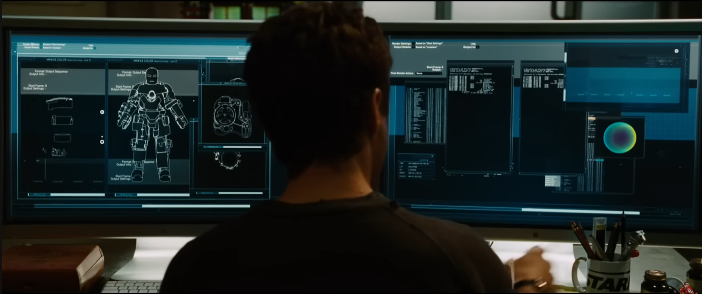
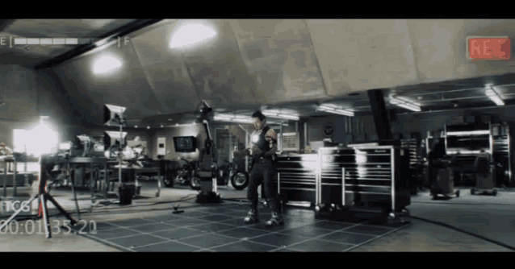

# Understanding Stark OS

When Tony Stark first started sketching the Mark-1 inside that cave, he knew one thing:  
a suit isn’t just metal-it needs systems that talk to each other, respond instantly, and never fail.  
Before he could build anything advanced, he had to understand how all the pieces would interact.

ROS (Robot Operating System) serves that same purpose for robotics.  
Stepping out of the cave analogy for a moment: ROS is an open-source framework that helps us structure robot software in a clean, modular, and scalable way. Instead of writing one giant program that controls everything, ROS encourages you to break a robot into smaller components-each responsible for a specific task.

Now jump back to Stark.  
Imagine the flamethrower, the servos, the power monitor, and the HUD all needing to coordinate.  
If he hard-wired everything manually, the suit would fall apart the moment one subsystem misbehaved.  
ROS solves this exact kind of challenge in robotics.

Instead of forcing the developer to manually manage every device and connection, ROS handles the backbone architecture behind the scenes-abstracting hardware so your code works across devices, enabling clean message communication between components, managing how programs are structured and reused, controlling motors and sensors cleanly, and even allowing different parts of a robot to run across multiple machines without you touching low-level networking. In short, it gives you reliable building blocks so you can focus on *behavior*, not plumbing-exactly what Stark needs when assembling the Mark-1's internal systems.

This week, we’ll begin assembling the foundations of **ROS**:  
exploring **nodes, topics, services, parameters, actions, packages, workspaces**, and **launch files**.  
You’ll see how each of these pieces fits into the larger architecture of a robotic system-much like each subsystem of the Mark-1 fits into the larger whole.

By the end of this week, you’ll understand the core structure that every ROS-based robot relies on- 
the same kind of structure Stark would rely on before building anything that could actually move.


---
## Configuring StarkOS Environment
Before the Mark-1 can respond, obey, or calculate anything, the cave terminal must be wired with the correct environment settings - just like Tony rerouting power through salvaged circuits.

---
## Step 1: Source the Core ROS2 Setup files
Every new terminal needs to load the Mark-1 system logic.

```bash
source /opt/ros/jazzy/setup.bash
```
To automatically initialize ROS in future terminals, add this line to your shell configuration:

`Note: Tony never repeats a command he can automate; the suit should always wake up ready.`
```bash
echo "source /opt/ros/jazzy/setup.bash" >> ~/.bashrc
```
`This ensures ROS boots with every terminal - the same way Mark-1 core systems initialize the moment the suit powers on.`

## Step 2: Verifying System Diagnostics
When Tony powers a new subsystem, he checks readings, voltages, and signals.
You’ll do the same with ROS environment variables
```bash
printenv | grep -i ROS
```
Check that the variables like `ROS_DISTRO` and `ROS_VERSION` are set.
```bash
ROS_VERSION=2
ROS_PYTHON_VERSION=3
ROS_DISTRO=jazzy
```
If these variables are not set correctly, which means something didn’t snap into place. Reinstall ROS - the Mark-1 doesn’t run on half-connected systems.

## Step 3: Assigning Domain ID
This is your Mark-1 frequency channel -
the identifier that prevents your system from interfering with other ROS devices around you.
Set the `domain ID`. For more information go [here](https://docs.ros.org/en/jazzy/Concepts/Intermediate/About-Domain-ID.html).
Set the domain ID between **0 and 101**.

```bash
echo "export ROS_DOMAIN_ID=<your_domain_id>" >> ~/.bashrc
```

---

## Installing `turtlesim` and `rqt`
Before piloting a jet-powered exosuit, Tony practiced with tiny subsystems.

`turtlesim` is your equivalent - a cute little robot to help you understand movement, commands, topics, and behavior.

`rqt` is your holographic UI -
a mini version of the Iron Man HUD for viewing and calling ROS functionality.

This will install some tools to have some hands on experience with the upcoming topics


### Task 1
Installing turtlesim
```bash
sudo apt update
sudo apt install ros-jazzy-turtlesim
```

To check if the package is installed, run the following command:
```bash
ros2 pkg executables turtlesim
```
It should output:
```bash
turtlesim draw_square
turtlesim mimic
turtlesim turtle_teleop_key
turtlesim turtlesim_node
```

### Task 2
Running turtlesim to check installation
```bash
ros2 run turtlesim turtlesim_node
```

It will open a window:


If the window opens correctly then congratulations `turtlesim` is installed correctly on your system.

<details>
    <summary>P.S. Click here if you want to have some fun with your newfound turtle</summary>

    Open a new terminal and run:

```bash
ros2 run turtlesim turtle_teleop_key
```

    You will be able to move your turtle now through the terminal!!
    This confirms that StarkOS can successfully issue movement commands-your first proof that the system can control something in the real (or simulated) world.
</details>

## Task 3: Activating StarkOS HUD (`rqt`)


Open a new terminal to install `rqt` and its plugins:
```bash
sudo apt update
sudo apt install '~nros-jazzy-rqt*'
```

To run `rqt` just run:
```bash
rqt
```


If this opens then your `rqt` is installed correctly.


---
Before Stark could weld metal plates or fire up thrusters, he needed to understand the **concepts** behind what he was building.  
In the quiet moments of the cave, he studied the scraps, traced power lines, tested circuits-learning how each part would behave once everything came alive.

The Mark-1 didn’t start with sparks;  
it started with **understanding**.

---

We’re in that same phase now.

This step is about configuring your environment so ROS2 Jazzy runs smoothly- 
but more importantly, it’s about learning the **core concepts** that shape every ROS system.

Before any hands-on coding or robot behavior, you need a sense of:

- how ROS organizes software  
- how components communicate  
- how a robot’s functionality is structured  

---

To begin learning these concepts, you’ll create your first ROS workspace and explore the ROS filesystem.  
This isn’t just setup-it’s understanding the structure you’ll rely on for the rest of the bootcamp.

---

Just as Stark had to grasp the fundamentals before assembling the suit,  
you need to understand the foundational concepts behind ROS.

And the first concept we explore?


**Packages.**


## What is a package?

<p align="center">
  
</p>

`"Tony Stark's package"`


In the world of ROS, a package is the key to organizing your programs, much like a case file contains all the details needed for investigation. Every ROS program you write is contained within a package, which can include source code (either Python or C++), configuration files, launch files, and dependencies. The package structure is organized into files and directories such as:

- `launch`: Contains launch files  
- `scripts`: Contains source files (Python)  
- `package.xml`: Information about the package and its dependencies  

In ROS2, Python or C++ are typically used for writing the script files in the package. If you want to move forward, understanding how to work with packages will be essential.

Just like Stark groups every component of the Mark-1 into functional modules, ROS expects you to organize your robot’s logic into packages before anything powerful can be built.


## Colcon

In the ROS ecosystem, software is organized into many packages. Unlike workflows where a developer works on just one package at a time, ROS developers often handle multiple packages simultaneously. To manage this, Colcon is used as a build tool to compile all the packages together with a single command.

Just like Stark tests entire suit subsystems together-not one bolt at a time-Colcon lets you build every ROS package in your workspace with a single, unified process.

To install and configure `colcon`, run:
```bash
sudo apt install python3-colcon-common-extensions
```

### Why colcon?
When Stark builds a suit, each subsystem depends on another-the thrusters rely on the power system, the power system relies on the reactor, and the HUD relies on sensors feeding it data. Change one part, and everything connected to it needs to adapt. Robotics software works the same way.

Imagine you’re working on a robot project, and you’ve divided the software into multiple packages:

- Package A: Reads sensor data.
- Package B: Processes that data.
- Package C: Controls the motors based on the processed data.

These packages depend on each other:

- If you make a change to Package A, Package B might need to adapt to the updated data structure.
- If you modify Package B, you’d need to ensure Package C works correctly with the updated processing logic.

This is exactly the kind of chain reaction Stark deals with-adjust the thruster output, and the stabilizers, HUD indicators, and power usage all need updating too.

Instead of manually building each package one by one and resolving dependencies yourself, Colcon automates this process. It:

- Detects all the packages in your workspace.
- Figures out the correct build order based on dependencies.
- Compiles everything with a single command: `colcon build`.

Just like Stark needs one system check that validates the entire suit, Colcon gives you one command that builds your entire ROS workspace-safely, cleanly, and in the right order.


## Workspace


`Tony Stark's current workspace`

When Stark started assembling the Mark-1 in the cave, he didn’t just scatter parts everywhere.  
He cleared a space, organized his tools, and created separate areas for the different projects he was juggling-the robotic arm dummy, the crude weapon his captors expected, and the real project he was secretly building: the Mark-1. Each needed its own space, its own tools, and its own structure.

A ROS workspace follows that same idea-a dedicated, organized area where all the pieces of your robot’s software live and build together without interfering with other projects.

A ROS workspace is a directory with a particular structure. Commonly, there is a `src` subdirectory. Inside that subdirectory is where the source code of ROS packages will be located.

Colcon, by default, creates the following directories in the workspace:

- The `build` directory will be where intermediate files are stored. For each package, a subfolder will be created.  
- The `install` directory is where each package will be installed to. By default, each package will be installed into a separate subdirectory.  
- The `log` directory contains various logging information about each colcon invocation.

Just like Stark keeps every project organized-ROS workspaces give you a clean structure so you always know where your code lives, how it’s built, and where the results end up.


### Creating a workspace
First, create a directory (`erc_ws`) to contain our workspace. 

Just like Stark clearing a corner of the cave to begin real work, this will be the space where all your ROS code comes together.

```bash
mkdir -p ~/erc_ws/src
cd ~/erc_ws
``` 

At this point your workspace contains a single empty director `src`.

From the root of your workspace (`erc_ws`), you can build your packages using the command:
```bash
cd ..
colcon build
```
butttt that won't really do anything because you don't have any packages yet :P

Even Stark couldn’t power the Mark-1 until he actually built something to connect to the reactor.

Remember how we sourced the jazzy setup earlier? Similarly, since we use custom packages we need to source them too. Run the command:
```bash
echo "source ~/erc_ws/install/setup.bash" >> ~/.bashrc
```
You can restart your terminal or run:
```bash
source ~/.bashrc
```
---
Let's now move onto some of the core concepts of ROS-the pieces that come together to form what’s known as the “ROS2 graph.”

<p align="center">
  
</p>

`Tony Stark's ROS2 Graph (lol just kidding)`


If the Mark-1 had its own internal schematic showing every system talking to every other system-power routing into motors, sensor data feeding targeting, stabilizers reacting to movement-that diagram would be Stark’s version of the ROS graph.

In ROS, the graph is the network of elements all running and communicating at the same time. It includes every executable and every connection between them, like a blueprint of how data flows through the robot.

And like any good blueprint, we begin with its most fundamental component:
**nodes.**

## Nodes

In ROS, each program is called a **node**, and each node handles one small, focused task.  
Think of it like the tiny subsystems inside Stark’s suit-not entire weapons or movement modules, but the *micro-functions* that make everything work:

- one module just regulates the temperature of the suit,  
- another monitors arc-reactor output,  
- another controls the tiny servos in each finger,  
- another reads sensors that check joint angles,  
- another updates the HUD with status alerts.

Each one is small, independent, and specialized-just like a ROS node.

A ROS node might control a motor, read a sensor, process a camera frame, or send commands to another component. Nodes communicate using **topics, services, actions, and parameters**, just as the suit’s internal functions constantly exchange data to keep Stark alive inside the armor.

We’ll dive into each communication method shortly.


The above is a visual representation of the flow of data between the nodes. 
A full robotic system is comprised of many nodes working in concert. In ROS 2, a single executable (C++ program, Python program, etc.) can contain one or more nodes.

### Experimenting with nodes
Time to test our first tiny “Mark-1 system”  in action.  
`Turtlesim` may look simple, but treat it like the suit’s very first servo test-small, but essential.

Run the program by using the `run` command:
```bash
ros2 run turtlesim turtlesim_node
```

Here, the package name is `turtlesim` and the executable name is `turtlesim_node`. However, we still don't know the node name :(

Open a new terminal and run:
```bash
ros2 node list
```
It should output
```bash
/turtlesim
```
Voila! We have the name of our turtlesim node. Unsurprisingly, it's also `turtlesim`.

Open another new terminal and run:
```bash
ros2 run turtlesim turtle_teleop_key
```
Here, we're still using the turtlesim package but now with a different executable `turtle_telep_key`

Return to the terminal where you ran `ros2 node list` and run it again. You should now see:
```bash
/turtlesim
/teleop_turtle
```

Two nodes online-one drawing the world, the other controlling movement.  
Just like the suit: one system generates visuals, another responds to Stark’s inputs.


These are the two nodes that we ran with our `run` commands. `teleop_turtle` is a node which sends messages/commands to the `turtlesim` node which then listens to that message and moves accordingly. 

### Remapping
Remapping allows you to reassign default node properties, like node name, topic names, service names, etc., to custom values.

Now, let's reassign the name of our `/turtlesim` node. In a **new terminal**, run:
```bash
ros2 run turtlesim turtlesim_node --ros-args --remap __node:=my_turtle
```
This will again open a `turtlesim` window but now run `ros2 node list` and you should see:
```bash
/my_turtle
/turtlesim
/turtle_teleop
```
The same executable is running with a different node name.

You’ve just done the ROS equivalent of Stark saying:  
“Hey suit, respond to *this* call sign instead.”  
Same node, new identity-instantly reassigned without touching the underlying code.


#### Node info
If you want to know a lot more about a particular node, you can run:
```bash
ros2 node info <node_name>
```

For example, after having run the previous command to make a `turtlesim` window with node name `my_turtle`, run:
```bash
ros2 node info my_turtle
```

This should output:
```bash
/my_turtle
  Subscribers:
    /parameter_events: rcl_interfaces/msg/ParameterEvent
    /turtle1/cmd_vel: geometry_msgs/msg/Twist
  Publishers:
    /parameter_events: rcl_interfaces/msg/ParameterEvent
    /rosout: rcl_interfaces/msg/Log
    /turtle1/color_sensor: turtlesim/msg/Color
    /turtle1/pose: turtlesim/msg/Pose
  Service Servers:
    /clear: std_srvs/srv/Empty
    /kill: turtlesim/srv/Kill
    /my_turtle/describe_parameters: rcl_interfaces/srv/DescribeParameters
    /my_turtle/get_parameter_types: rcl_interfaces/srv/GetParameterTypes
    /my_turtle/get_parameters: rcl_interfaces/srv/GetParameters
    /my_turtle/get_type_description: type_description_interfaces/srv/GetTypeDescription
    /my_turtle/list_parameters: rcl_interfaces/srv/ListParameters
    /my_turtle/set_parameters: rcl_interfaces/srv/SetParameters
    /my_turtle/set_parameters_atomically: rcl_interfaces/srv/SetParametersAtomically
    /reset: std_srvs/srv/Empty
    /spawn: turtlesim/srv/Spawn
    /turtle1/set_pen: turtlesim/srv/SetPen
    /turtle1/teleport_absolute: turtlesim/srv/TeleportAbsolute
    /turtle1/teleport_relative: turtlesim/srv/TeleportRelative
  Service Clients:

  Action Servers:
    /turtle1/rotate_absolute: turtlesim/action/RotateAbsolute
  Action Clients:
```
This gives detailed info about a particular node. It gives a list of subscribers, publishers, services, and actions. i.e. the ROS graph connections that interact with that node.

This is the ROS equivalent of Stark pulling up diagnostics on a single suit component- 
checking what signals it sends, what it listens to, and what capabilities it exposes.


## Topics
ROS 2 breaks complex systems down into many modular nodes. Topics are a vital element of the ROS graph that act as a bus for nodes to exchange messages.

Think of topics as the suit’s data channels-the paths where information flows between its micro-systems.


A node may publish data to any number of topics and simultaneously have subscription to any number of topics. 


### Experimenting with Topics
Let's start off with our trusty old turtlesim.
Open a new terminal and run:
```bash
ros2 run turtlesim turtlesim_node
```

Open another terminal and run:
```bash
ros2 run turtlesim turtle_teleop_key
```


Tony Stark has all the fancy holographic diagnostics to analyze his suit- 
but since we don’t have a HUD projector (yet), we use `rqt_graph` instead.

Throughout this section, we’ll use `rqt_graph` to visualize the nodes, topics, and the connections between them.  
`rqt_graph` is a plugin of `rqt`, which you installed earlier.


To run `rqt_graph`, open a new terminal and enter the command:
```bash
ros2 run rqt_graph rqt_graph
```
You can also open rqt_graph by opening `rqt` and selecting Plugins > Introspection > Node Graph.

> On start, your Node Graph might look empty. If it is, just click on the refresh button in the top left corner
> 

If the dropdown says "Nodes only", change it to "Nodes/Topics(active)". 
Also, set the **Group** counter right below the refresh button to 0.

You should be seeing something like this:


You should see the above nodes and topic, as well as two actions around the periphery of the graph (let’s ignore those for now). If you hover your mouse over the topic in the center, you’ll see the color highlighting like in the image above.

The graph is depicting how the `/turtlesim` node and the `/teleop_turtle` node are communicating with each other over a topic. The `/teleop_turtle` node is publishing data (the keystrokes you enter to move the turtle around) to the `/turtle1/cmd_vel topic`, and the `/turtlesim` node is subscribed to that topic to receive the data.

The highlighting feature of rqt_graph is very helpful when examining more complex systems with many nodes and topics connected in many different ways.

This is basically the suit’s comms map-who’s sending signals, who’s listening, and how everything stays in sync.

rqt_graph is a graphical introspection tool. Now we’ll look at some command line tools for introspecting topics.

### `ros2 topic list`
Running the `ros2 topic list` command in a new terminal will output:
```bash
/parameter_events
/rosout
/turtle1/cmd_vel
/turtle1/color_sensor
/turtle1/pose
```

`ros2 topic list -t` will return the same list of topics but with the topic type appended to it:
```bash
/parameter_events [rcl_interfaces/msg/ParameterEvent]
/rosout [rcl_interfaces/msg/Log]
/turtle1/cmd_vel [geometry_msgs/msg/Twist]
/turtle1/color_sensor [turtlesim/msg/Color]
/turtle1/pose [turtlesim/msg/Pose]
```
These attributes, particularly the type, are how nodes know they’re talking about the same information as it moves over topics.

If you're wondering where all the topics are in `rqt_graph`, uncheck all the boxes under **Hide**.
But for our use case let's keep all the boxes checked.

Think of it like Stark pulling up a list of all active suit channels-power feeds, sensor pings, HUD alerts-each one a data stream flowing through the armor.

### `ros2 topic echo`
To see the data being published on a topic, use:
```bash
ros2 topic info <topic_name>
```
Since we know that `/teleop_turtle` publishes data to `/turtlesim` over the `/turtle1/cmd_vel` topic, let's use `echo` to introspect that topic:
```bash
ros2 topic info /turtle1/cmd_vel
```

At first, this command won’t return any data. That’s because it’s waiting for `/teleop_turtle` to publish something.

Return to the terminal where `turtle_teleop_key` is running and use the **arrows** to move the turtle around. Watch the terminal where your echo is running at the same time, and you’ll see position data being published for every movement you make:
```bash
linear:
  x: 2.0
  y: 0.0
  z: 0.0
angular:
  x: 0.0
  y: 0.0
  z: 0.0
---
linear:
  x: -2.0
  y: 0.0
  z: 0.0
angular:
  x: 0.0
  y: 0.0
  z: 0.0
...
```
This is the ROS version of watching real-time diagnostics on the suit.  
Every arrow key press is like Stark moving his hand-the HUD immediately shows the output.


### `ros2 interface show`
Nodes send data over topics using messages. Publishers and subscribers must send and receive the same type of message to communicate.

The topic types we saw earlier after running `ros2 topic list -t` let us know what message type is used on each topic. Recall that the `cmd_vel` topic has the type `geometry_msgs/msg/Twist`.

This means that in the package `geometry_msgs` there is a `msg` called `Twist`.

Now we can run `ros2 interface show <msg_type>` on this type to learn its details. Specifically, what structure of data this message expects.

```bash
ros2 interface show geometry_msgs/msg/Twist
```

Which will return:
```bash
# This expresses velocity in free space broken into its linear and angular parts.

Vector3  linear
	float64 x
	float64 y
	float64 z
Vector3  angular
	float64 x
	float64 y
	float64 z
```

This tells you that the `/turtlesim` node is expecting a message with two vectors, `linear` and `angular`, of three elements each. If you recall the data we saw `/teleop_turtle` passing to `/turtlesim` with the `echo` command, it’s in the same structure.


## Services

Services are another method of communication for nodes in the ROS graph. Services are based on a call-and-response model versus the publisher-subscriber model of topics. While topics allow nodes to subscribe to data streams and get continual updates, services only provide data when they are specifically called by a client.

It’s like Stark saying, “Open the faceplate.”  
The suit performs the action only when commanded-it doesn’t keep opening and closing on its own.

That’s how a ROS service behaves.

A single ROS service server can handle requests from many clients.  
Think of the Iron Man faceplate: there’s only **one** mechanism that opens it (the server), but **multiple clients** can request it-Tony, Pepper over comms, or even an emergency protocol. Different requesters, same action mechanism.


### Experimenting with Services

Set up the two turtlesim nodes, if not already.

```bash
ros2 run turtlesim turtlesim_node
```
In another terminal:
```bash
ros2 run turtlesim turtle_teleop_key
```

Running the `ros2 service list` command in a new terminal will return a list of all the services currently active in the system:
```bash
$ ros2 service list
/clear
/kill
/reset
/spawn
/teleop_turtle/describe_parameters
/teleop_turtle/get_parameter_types
/teleop_turtle/get_parameters
/teleop_turtle/get_type_description
/teleop_turtle/list_parameters
/teleop_turtle/set_parameters
/teleop_turtle/set_parameters_atomically
/turtle1/set_pen
/turtle1/teleport_absolute
/turtle1/teleport_relative
/turtlesim/describe_parameters
/turtlesim/get_parameter_types
/turtlesim/get_parameters
/turtlesim/get_type_description
/turtlesim/list_parameters
/turtlesim/set_parameters
/turtlesim/set_parameters_atomically
```

You will see that both nodes have the same six services with parameters in their names. Nearly every node in ROS 2 has these infrastructure services that parameters are built off of. There will be more about parameters in the next section.

### `ros2 service type`

Services have types that describe how the request and response data of a service is structured. Service types are defined similarly to topic types, except service types have two parts: one message for the request and another for the response.

This is like checking the exact protocol the suit expects for a command.
Some functions need detailed instructions-others, like “clear display,” need nothing at all.

To find out the type of a service, use the command:
```bash
ros2 service type <service_name>
```
Let’s take a look at turtlesim’s `/clear` service. In a new terminal, enter the command:
```bash
ros2 service type /clear
```
It should output:
```bash
std_srvs/src/Empty
```
The `Empty` type means the service call sends no data when making a request and receives no data when receiving a response.


Similar to topics, if you want to see the type of service alongside the list, run:
```bash
ros2 service list -t
```
Think of this as Stark pulling up a list of all suit abilities currently online-commands the armor can execute the moment he asks for them.

### `ros2 service info`

To see information of a particular service, use the command:
```bash
ros2 service info <service_name>
```

This is the diagnostics screen Stark uses to see which suit functions are active, who can trigger them, and whether the system is ready to respond.

This returns the service type and the count of service clients and servers.

For example, you can find the count of clients and servers for the `/clear` service:
```bash
$ ros2 service info /clear
Type: std_srvs/srv/Empty
Clients count: 0
Services count: 1
```

## Launch files
ROS 2 Launch files allow you to start up and configure a number of executables containing ROS 2 nodes simultaneously.

Think of a launch file as Stark hitting one button in the cave and watching multiple subsystems boot up at once-lights flicker on, servos hum, diagnostics scroll.
One command. Many systems awakening.

To start off, let us create a new package in our workspace.
```bash
cd ~/erc_ws/src
ros2 pkg create --build-type ament_python week1_tutorials
cd week1_tutorials
```

Create a new directory in `erc_ws/src/week1_tutorials` to store your launch files:
```bash
cd ~/erc_ws/src/week1_tutorials
mkdir launch
```

Let’s put together a ROS 2 launch file using the turtlesim package and its executables.
```bash
cd launch
touch turtlesim_mimic_launch.py
chmod +x turtlesim_mimic_launch.py
```

This file is going to act like a mini “Mark-1 startup sequence.”
When it runs, multiple nodes will launch in perfect sync-just like Stark powering up separate suit modules together.

Open this directory with `VS Code` or whatever your default code editor is configured to with:
```bash
code .
```

> If you're running a fresh install of Ubuntu 24.04, you may get an error message saying `command not found: code`. 
> If yes, copy paste the commands:
> ```bash
> wget 'https://code.visualstudio.com/sha/download?build=stable&os=linux-deb-x64' -O /tmp/code_latest_amd64.deb
> sudo dpkg -i /tmp/code_latest_amd64.deb
> ```

> If prompted by a message saying "Do you trust the authors?", click on YES.

Copy and paste the complete code into the `launch/turtlesim_mimic_launch.py` file:
```python
from launch import LaunchDescription
from launch_ros.actions import Node

def generate_launch_description():
    return LaunchDescription([
        Node(
            package='turtlesim',
            namespace='turtlesim1',
            executable='turtlesim_node',
            name='sim'
        ),
        Node(
            package='turtlesim',
            namespace='turtlesim2',
            executable='turtlesim_node',
            name='sim'
        ),
        Node(
            package='turtlesim',
            executable='mimic',
            name='mimic',
            remappings=[
                ('/input/pose', '/turtlesim1/turtle1/pose'),
                ('/output/cmd_vel', '/turtlesim2/turtle1/cmd_vel'),
            ]
        )
    ])
```

Take your time and understand the above code. Pay special attention to how we are calling multiple nodes along with their respective names and mappings.

Each Node() entry here is like toggling on a separate component of the suit-one for visuals, one for motion, and the mimic node acting as the suit’s internal autopilot linking them together.

Save the changes to the file (`CTRL`+`S`) and close the window.
To run the launch file created above:
```bash
cd ~/erc_ws/src/week1_tutorials/launch
ros2 launch turtlesim_mimic_launch.py
```

Yayy! You've successfully created two identical turtles from a single command!!
But they're just stationary. Let's make them move without using our teleop node.

## Publishing Messages
To see the system in action, open a new terminal and run the `ros2 topic pub` command on the `/turtlesim1/turtle1/cmd_vel` topic to get the first turtle moving

The topic `/turtlesim1/turtle1/cmd_vel` is responsible for moving the turtle. As you saw earlier, the movement commands you gave via the `turtle_teleop` node were published to the `cmd_vel` topic as well. 

```bash
cd ~/erc_ws/src/week1_tutorials/launch
```

```bash
ros2 topic pub -r 1 /turtlesim1/turtle1/cmd_vel geometry_msgs/msg/Twist "{linear: {x: 2.0, y: 0.0, z: 0.0}, angular: {x: 0.0, y: 0.0, z: -1.8}}"
```

But what does this command mean? Let's break it down:

- `ros2 topic pub -r 1` publishes a message to a particular topic at a rate of 1 Hz.
- `/turtlesim1/turtle1/cmd_vel` is the topic to which we are publishing
- `geometry_msgs/msg/Twist` is the type of message we are publishing. As we saw earlier, [here](#ros2-topic-list), that is the type of message that the `cmd_vel` topic uses
- `{linear: {x: 2.0, y: 0.0, z: 0.0}, angular: {x: 0.0, y: 0.0, z: -1.8}}` is the actual message that we publish to that topic. As we saw in the [ros2 interface](#ros2-interface-show) section, the format of the `Twist` message is observed

This is the closest thing to “manual suit control.”
You’re injecting velocity commands straight into the system-no intermediary node, no UI, just pure control flow like Stark hot-wiring the Mark-1.

This was an easy example of publisher-subscriber using the builtin topics of ROS. Later, we will see how to built it from scratch.


Your file structure will look something like this now:
```bash
erc_ws/
└── src
    └── week1_tutorials
        ├── launch
        │   └── turtlesim_mimic_launch.py
        ├── package.xml
        ├── resource
        │   └── week1_tutorials
        ├── setup.cfg
        ├── setup.py
        ├── test
        │   ├── test_copyright.py
        │   ├── test_flake8.py
        │   └── test_pep257.py
        └── week1_tutorials
            └── __init__.py

8 directories, 10 files

```

Consider this your first real “Mark-1 cave directory.”
A simple layout now-but every great system starts with a clean structure.

> **PS:** In the turtlesim_launch we run the launch file from the same directory, if we want to run it from any directory using the generalized command, i.e.
>```bash
>ros2 launch <package name> <launch file name> 
>```
> We have to specify the path in `setup.py` and then go to workspace directory and then colcon build, and run this. Here we exceuted the run file directly from the directory, though we will do this later in the end of the tutorial in the `pubsub.launch.py` case.


## Publisher-Subscriber Interface

Message passing in ROS happens with the Publisher-Subscriber interface provided by the ROS library functions.

Creating a publisher or subscriber node is just like creating any other node:

1. Go to the package where you want to create these nodes
2. Make a new directory `scripts`
3. Create python script files for a publisher and a subscriber

### Create an executable python file
Navigate into `erc_ws/src/week1_tutorials/week1_tutorials` and then create a python file
```bash
cd ~/erc_ws/src/week1_tutorials/week1_tutorials
touch talker.py
chmod +x talker.py # Making the python file executable
```

### Writing a simple Publisher Node
This is a basic publisher node python script `talker.py` (taken from the official ROS tutorials from the website, and comments are added to help you understand the working of each line):

This will be your very first custom-built ROS node-the Mark-1’s version of a “Hello World” repulsor test.

Open VS Code using `code .`

Paste the following in the `talker.py`

```python
#!/usr/bin/env python
import rclpy
from std_msgs.msg import String

def timer_callback(timer, i):
    # Create a String message
    msg = String()
    msg.data = 'Hello World'

    # Publish the message using the global publisher
    publisher.publish(msg)

    # Print a message indicating what is being published
    print('Publishing: "%s"' % msg.data)

def main(args=None):
    # Initialize the ROS 2 system
    rclpy.init(args=args)

    # Create a ROS 2 node named 'minimal_publisher'
    node = rclpy.create_node('minimal_publisher')

    # Create a global publisher for the 'topic' with a message type of String
    global publisher
    publisher = node.create_publisher(String, 'topic', 10)

    # Set the timer period to 0.5 seconds
    timer_period = 0.5

    # Initialize a counter variable
    i = 0

    # Create a timer that calls the timer_callback function every timer_period seconds
    timer = node.create_timer(timer_period, lambda: timer_callback(timer, i))

    # Increment the counter
    i += 1

    try:
        # Start spinning the ROS 2 node
        rclpy.spin(node)
    finally:
        # Destroy the node explicitly when done spinning
        # (optional - otherwise it will be done automatically
        # when the garbage collector destroys the node object)
        node.destroy_node()

        # Shutdown the ROS 2 system
        rclpy.shutdown()

# Entry point to the script
if __name__ == '__main__':
    # Call the main function if this script is the main module
    main()
```

Take your time and look at the code and try to understand. Save the file.

### Add dependencies
> Dependencies are packages or libraries that a ROS package needs to compile and run. These are often declared in the package.xml file or the CMakeLists.txt file of a package.

Navigate to `erc_ws/src/week1_tutorials` directory, where the `setup.py`, `setup.cfg`, and `package.xml` files have been created

```bash
cd ~/erc_ws/src/week1_tutorials
code .
```

Open `package.xml` with your text editor. Add the following dependencies corresponding to your node's import statements:
```html
<exec_depend>rclpy</exec_depend>
<exec_depend>std_msgs</exec_depend>
```
Add these after the `<test_depend>..</test_depend>` lines.
Save the changes to the file.
This declares that the package needs `rclpy` and `std_msgs` when its code is executed

Just like Stark confirming which components the prototype needs before powering it on-no missing parts, no surprises.

### Add an entry point
Open the `setup.py` file, and add the following line within the `console_scripts` brackets of the `entry_points` field:

```python
entry_points={
    'console_scripts': [
        'publisher = week1_tutorials.talker:main',
    ],
},
```
Adding this entry point is like giving the subsystem a call sign.
Now ROS knows exactly how to launch your publisher node on command.


This is the ROS equivalent of Stark clearing a corner of the cave and wiring up his first test circuit-a tiny subsystem that sends out data into the suit.

### Writing a simple Subscriber Node
If the publisher was Stark building a tiny module that speaks, the subscriber is the one that listens.
Every suit needs both-output and feedback.

Make the `listener.py` similarly as we have done for `talker.py`  
This is a basic subscriber node python script `listener.py` (taken from the official ROS tutorials from the website, and comments are added to help you understand the working of each line):
```bash
cd ~/erc_ws/src/week1_tutorials/week1_tutorials
touch listener.py
chmod +x listener.py
```

Paste the following in the `listener.py`:
```python
#!/usr/bin/env python
import rclpy
from std_msgs.msg import String

def listener_callback(msg):
    print('I heard: "%s"' % msg.data)

def main(args=None):
    # Initialize the ROS 2 system
    rclpy.init(args=args)

    # Create a ROS 2 node named 'minimal_subscriber'
    node = rclpy.create_node('minimal_subscriber')

    # Create a subscription to the 'topic' with a message type of String
    subscription = node.create_subscription(String, 'topic', listener_callback, 10)

    # Prevent unused variable warning
    subscription

    try:
        # Start spinning the ROS 2 node
        rclpy.spin(node)
    finally:
        # Destroy the node explicitly when done spinning
        # (optional - otherwise it will be done automatically
        # when the garbage collector destroys the node object)
        node.destroy_node()

        # Shutdown the ROS 2 system
        rclpy.shutdown()

# Entry point to the script
if __name__ == '__main__':
    # Call the main function if this script is the main module
    main()
```

Save the file.  
Now we have to add entry points for the subscriber node just like we did for the publisher node

```bash
cd ~/erc_ws/src/week1_tutorials
code .
```

Change the following in `setup.py`:
```python
entry_points={
    'console_scripts': [
        'publisher = week1_tutorials.talker:main',
        'subscriber = week1_tutorials.listener:main',
    ],
},
```
You’re essentially giving this new listener module its own activation protocol-so StarkOS knows how to launch it just like any other suit component.

Save the file.

This is the Mark-1’s “ears”-a node waiting patiently for incoming messages, ready to report whatever it hears.

### Build and run
You likely already have the `rclpy` and `std_msgs` packages installed as part of your ROS2 system. It's good practice to run `rosdep` in the root of your workspace (`erc_ws`) to check for missing dependencies before building:
>Rosdep is a command-line tool that identifies and installs system dependencies for ROS (Robot Operating System) packages.
```bash
cd ~/erc_ws
```

*Optional*
```bash
rosdep install -i --from-path src --rosdistro jazzy -y
```

Think of rosdep as the suit’s system check-Stark never powers anything up before scanning for missing parts or faulty connections.

<p align="center">
  
</p>

`What happens if you don't check for bugs properly`

> While running this for the first time, you may get an ERROR saying `rosdep installation has not been initialized yet`. Don't worry that's normal. Just run the commands given below and will probably be listed in your command line as well:
> ```bash
> sudo rosdep init
> rosdep update
>```
> This will update your ROS2 caches.
> Now run the given `rosdep` command again.

Finally, we build the workspace
```bash
cd ~/erc_ws
colcon build
```

Now we source the setup files:
> We do this to ensure that the custom packages and nodes that you make are available to the terminal `ros2` command. It's used to set up your environment. After every `colcon build`, **make sure to source your setup**.

Sourcing is like reconnecting the suit’s power bus — the system won’t recognize new modules until the link is refreshed

```bash
source install/setup.bash
```

Now run the publisher node:
```bash
ros2 run week1_tutorials publisher
```

Open a new terminal and run the publisher node. Make sure to source the setup files
```bash
source ~/erc_ws/install/setup.bash
ros2 run week1_tutorials subscriber
```

You can see that `I heard: "Hello World"` is being printed in the subscriber terminal and the publisher terminal is printing `Publishing: "Hello World"`.  
You can change the message to whatever you want by modifying `msg.data` in `talker.py`

This is your first live data loop — one part of the system speaking, the other responding.
It’s the Mark-1 equivalent of Stark firing a test pulse and watching the HUD confirm the signal.

Note that once you stop the publisher node, the subscriber node stops as well.
(You can stop the running by pressing `CTRL`+`C`)

<p align="center">
  
</p>

`How does working in ROS feel like`

### Running the publisher and subscriber from a launch file
Create a file `pubsub.launch.py` in the `launch` folder of `erc_ws/src/week1_tutorials`

This launch file is your first automated boot sequence — the same idea as Stark pressing one button and watching multiple suit systems power on together

```bash
cd ~/erc_ws/src/week1_tutorials/launch
touch pubsub.launch.py
chmod +x pubsub.launch.py
code .
```

Add the following code to the file:
```python
from launch import LaunchDescription
from launch_ros.actions import Node

def generate_launch_description():
    return LaunchDescription([
        Node(
            package='week1_tutorials',
            executable='publisher',
        ),
        Node(
            package='week1_tutorials',
            executable='subscriber',
        ),
    ])
```

`package` refers to the name of the package from which you are running the executable  
`executable` refers to the name of the executable

In other words, this file tells ROS:
“When the system boots, bring these two modules online.”
Exactly how Stark orchestrates multiple subsystems during suit startup.

```bash
cd ~/erc_ws/src/week1_tutorials
code .
```

Now add the following line in `setup.py` in the `data_files`
```python
(os.path.join('share', package_name, 'launch'), glob(os.path.join('launch', 'pubsub.launch.py'))),
```

It should look like this:
```python
data_files=[
    ('share/ament_index/resource_index/packages',
        ['resource/' + package_name]),
    ('share/' + package_name, ['package.xml']),
    (os.path.join('share', package_name, 'launch'), glob(os.path.join('launch', 'pubsub.launch.py'))),
],
```

This step registers your launch file with the ROS ecosystem — like adding a new entry into the suit’s internal command menu.

Add import statements for `os` and `glob` on top of the `setup.py` file:
```python
import os
from glob import glob
```
These imports help ROS locate and load your launch file during runtime, just like the suit needs the correct directories wired before executing a startup script.

On executing `ros2 launch week1_tutorials pubsub.launch.py`, you will be able to see **Publisher** and **Subscriber** in the list of nodes.

With one command, both nodes activate — the publisher speaks, the subscriber listens.
It’s your first coordinated StarkOS launch.

While it is still running, you can run `rqt_graph` on another terminal to see the relationship betweeen the nodes and topics graphed out visually.

Opening `rqt_graph` now feels like watching a mini Mark-1 schematic:
lines flowing between systems, data moving live, the whole loop breathing for the first time.

# 🚀 Assignment — Stark OS: Multi-Node Communication Test

Create a new package `stark_os` inside your `erc_ws` workspace.  
This package will contain **three nodes** and **one launch file**.

Your mission: simulate a small part of Tony Stark’s Mark-1 diagnostics system using ROS2 publishers and subscribers.

---

## 1️⃣ Node 1 — Publish to `reactor_status`

This node should publish the following text to the topic `reactor_status`:

`Arc Reactor online. Output stable.`


---

## 2️⃣ Node 2 — Publish to `system_diag`

This node should publish the following text to the topic `system_diag`:

`Suit integrity at 85%. All systems responsive.`


---

## 3️⃣ Node 3 — Subscribe to both topics

This node should subscribe to **both** `reactor_status` and `system_diag`.

It must combine both messages and print the following line at some frequency:

`Arc Reactor online. Output stable. Suit integrity at 85%. All systems responsive.`


This is your mini Mark-1 HUD diagnostic readout.

---

## 4️⃣ Launch File

Create a launch file that starts **all three nodes** together —  
your own tiny Mark-1 boot sequence.

Just like how Mark-1 boots up here

<p align="center">
  
</p>

---

## 🔥 That’s it for this week.

You’ve built the first real building blocks of Stark OS — nodes, topics, services, launches…  
The Mark-1’s mind is no longer theory. It’s alive.

And now…  
as Tony would say after pulling off something ridiculously impressive:

**“Not bad. Not bad at all.”**


---

Suit up —  
**Next week, StarkOS gets *serious*.**

---
