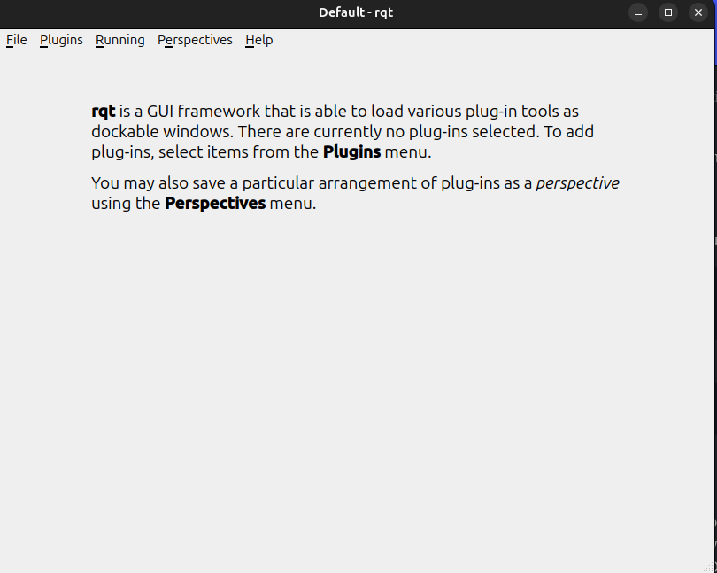
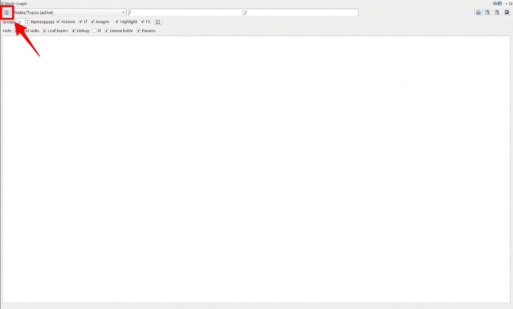
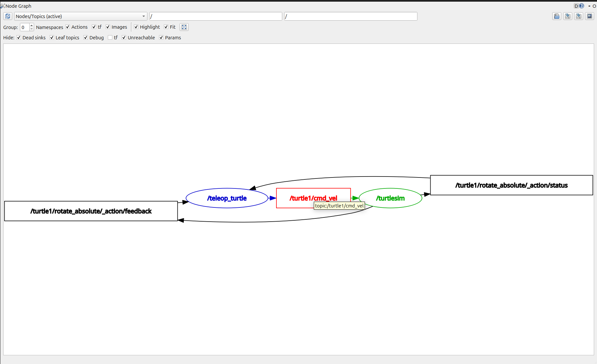
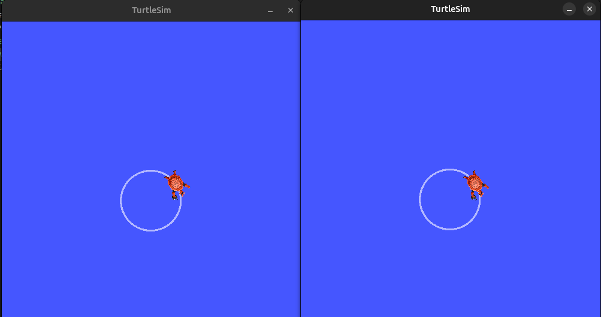

# Understanding Stark OS
ROS (Robot Operating System) is an open-source software framework designed for writing robot software, much like how Sherlock Holmes uses his toolkit to solve mysteries. Just as Holmes relies on his magnifying glass and sharp reasoning to uncover hidden details, ROS equips developers with the essential tools and libraries to navigate the complexities of robot development. Its primary goal is to help developers reuse software across the globe, making it easier to create complex robot behaviors on a variety of platforms.

ROS offers services like hardware abstraction, low-level device control, message-passing between processes, and package management. With its set of tools and libraries for obtaining, building, writing, and running code across multiple computers, ROS enables developers to seamlessly construct sophisticated robotic systems. While it shares similarities with other robotic frameworks like Player, YARP, and Microsoft Robotics Studio, its open-source nature and active community support make it stand out as the go-to toolkit for robotic development.

This Week will cover the core ROS 2 concepts including working with nodes, topics, services, parameters and more through practical examples using the ROS 2 Humble release.
## Configuring Environment

### Step 1
Source the setup files
```bash
source /opt/ros/jazzy/setup.bash
```
If you don't want to do this in every terminal session then run:
```bash
echo "source /opt/ros/jazzy/setup.bash" >> ~/.bashrc
```

### Step 2
Sourcing ROS2 setup files will set environment variables necessary for operating ROS2. Make sure your environment is properly set up usinng the following command:
```bash
printenv | grep -i ROS
```
Check that the variables like `ROS_DISTRO` and `ROS_VERSION` are set.
```bash
ROS_VERSION=2
ROS_PYTHON_VERSION=3
ROS_DISTRO=jazzy
```
If these variables are not set correctly, return to the ROS2 package installation and try again.

### Step 3
Set the `domain ID`. For more information go [here](https://docs.ros.org/en/jazzy/Concepts/Intermediate/About-Domain-ID.html).
Set the domain ID between **0 and 101**.

```bash
echo "export ROS_DOMAIN_ID=<your_domain_id>" >> ~/.bashrc
```

---

## Installing `turtlesim` and `rqt`
This will install some tools to have some hands on experience with the upcoming topics

### Task 1
Installing turtlesim
```bash
sudo apt update
sudo apt install ros-jazzy-turtlesim
```

To check if the package is installed, run the following command:
```bash
ros2 pkg executables turtlesim
```
It should output:
```bash
turtlesim draw_square
turtlesim mimic
turtlesim turtle_teleop_key
turtlesim turtlesim_node
```

### Task 2
Running turtlesim to check installation
```bash
ros2 run turtlesim turtlesim_node
```

It will open a window:


If the window opens correctly then congratulations `turtlesim` is installed correctly on your system.

<details>
    <summary>P.S. Click here if you want to have some fun with your newfound turtle</summary>

    Open a new terminal and run:

```bash
ros2 run turtlesim turtle_teleop_key
```

    You will be able to move your turtle now through the terminal!!
</details>

### Task3

Open a new terminal to install `rqt` and its plugins:
```bash
sudo apt update
sudo apt install '~nros-jazzy-rqt*'
```

To run `rqt` just run:
```bash
rqt
```

If this opens then your `rqt` is installed correctly.


---
This is just for configuring your environment to work correctly with ROS2 Jazzy. Before we get into the actual hands on work let's get to know ROS2 a little bit. To get started, you'll need to create a ROS workspace and navigate the ROS filesystem. We'll walk you through some key tools, and the next few tutorials will focus on settinng up your environment. We start off with packages.


<!-- ## Using `turtlesim`, `ros2`, and `rqt`
Turtlesim is a lightweight simulator for learning ROS 2. It illustrates what ROS 2 does at the most basic level to give you an idea of what you will do with a real robot or a robot simulation later on.

rqt is a graphical user interface (GUI) tool for ROS 2. Everything done in rqt can be done on the command line, but rqt provides a more user-friendly way to manipulate ROS 2 elements.

### Task 1
Installing turtlesim
```bash
sudo apt update
sudo apt install ros-jazzy-turtlesim
```

To check if the package is installed, run the following command:
```bash
ros2 pkg executables turtlesim
```
It should output:
```bash
turtlesim draw_square
turtlesim mimic
turtlesim turtle_teleop_key
turtlesim turtlesim_node
```

## Task 2
Running turtlesim
```bash
ros2 run turtlesim turtlesim_node
```

It will open a window:


Open a new terminal and run:
```bash
ros2 run turtlesim turtle_teleop_key
```

You will be able to move your turtle now through the terminal!!

## Task 3
Open a new terminal to install `rqt` and its plugins:
```bash
sudo apt update
sudo apt install '~nros-jazzy-rqt*'
```

To run `rqt` just run:
```bash
rqt
```

When running `rqt` for the first time, the window will be blank. Just select **Plugins > Services > Service Caller** from the menu bar on top.

> Note: It may take some time for rqt to locate all the plugins. If you click on Plugins but don’t see Services or any other options, you should close rqt and enter the command `rqt --force-discover` in your terminal.


Use the refresh button to the left of the **Service** dropdown list to ensure all the services of your turtlesim node are visible.

### Try the spawn service
Click on the **Service** dropdown and and select the `/spawn` service.


Give the new turtle a unique name, like `turtle2`, by double-clicking between the empty single quotes in the Expression column. You can see that this expression corresponds to the value of name and is of type string.

Next enter some valid coordinates at which to spawn the new turtle, like `x = 1.0` and `y = 1.0`.

> Note: If you try to spawn a new turtle with the same name as an existing turtle, like the default turtle1, you will get an error message in the terminal running turtlesim_node
> `[ERROR] [turtlesim]: A turtle named [turtle1] already exists`

If you're successful, you should see a new turtle spawn in your existing window!!!

### Remapping controls
You need a second teleop node in order to control `turtle2`. However, if you try to run the same command as before, you will notice that this one also controls `turtle1`. The way to change this behavior is by remapping the `cmd_vel` topic.

In a new terminal, run:
```bash
ros2 run turtlesim turtle_teleop_key --ros-args --remap turtle1/cmd_vel:=turtle2/cmd_vel
```
Now you can move `turtle2` in this terminal!!

---

This is it for the initial part of this ROS2 bootcamp. Stay tuned for next week!! -->

## What is a package?
In the world of ROS, a package is the key to organizing your programs, much like a case file contains all the details needed for investigation. Every ROS program you write is contained within a package, which can include source code (either Python or C++), configuration files, launch files, and dependencies. The package structure is organized into files and directories such as:

- `launch`: Contains launch files
- `scripts`: Contains source files (Python)
- `package.xml`: Information about the package and its dependencies

In ROS2, Python or C++ are typically used for writing the script files in the package. If you want to move forward, understanding how to work with packages will be essential.

## Colcon

In the ROS ecosystem, software is organized into many packages. Unlike workflows where a developer works on just one package at a time, ROS developers often handle multiple packages simultaneously. To manage this, Colcon is used as a build tool to compile all the packages together with a single command.

To install and configure `colcon`, run:
```bash
sudo apt install python3-colcon-common-extensions
```

### Why colcon?
Imagine you’re working on a robot project, and you’ve divided the software into multiple packages:

- Package A: Reads sensor data.
- Package B: Processes that data.
- Package C: Controls the motors based on the processed data.

These packages depend on each other:

- If you make a change to Package A, Package B might need to adapt to the updated data structure.
- If you modify Package B, you’d need to ensure Package C works correctly with the updated processing logic.

Instead of manually building each package one by one and resolving dependencies yourself, Colcon automates this process. It:

- Detects all the packages in your workspace.
- Figures out the correct build order based on dependencies.
- Compiles everything with a single command: colcon build.

## Workspace
A ROS workspace is a directory with a particular structure. Commonly, there is a `src` subdirectory. Inside that subdirectory is where the source code of ROS packages will be located.
Colcon, by default, creates the following directories in the workspace:

- The `build` directory will be where intermediate files are stored. For each package a subfolder will be created.
- The `install` directory is where each package will be installed to. By default each package will be installed into a separate subdirectory.
- The `log` directory contains various logging information about each colcon invocation.

### Creating a workspace
First, create a directory (`erc_ws`) to contain our workspace. 
```bash
mkdir -p ~/erc_ws/src
cd ~/erc_ws
``` 

At this point your workspace contains a single empty director `src`.

From the root of your workspace (`erc_ws`), you can build your packages using the command:
```bash
cd ..
colcon build
```
butttt that won't really do anything because you don't have any packages yet :P

Remember how we sourced the jazzy setup earlier? Similarly, since we use custom packages we need to source them too. Run the command:
```bash
echo "source ~/erc_ws/install/setup.bash" >> ~/.bashrc
```
You can restart your terminal or run:
```bash
source ~/.bashrc
```
---
Let's now move onto some of the core concepts of ROS. These concepts make up what is referred to as the "ROS2 graph".

The ROS graph is a network of ROS2 elements processing data together at the same time. It encompasses all executables and the connections between them if you were to map them all out and visualize them.
Starting off with nodes.
## Nodes

In ROS, each program is called a node. Each node in ROS is responsible for a single, modular purpose, e.g.controlling the wheel motors or publishing the sensor data from a laser range-finder. Each node can send and receive data from other nodes via topics, services, actions, or parameters. We will be touching up on these shortly.


The above is a visual representation of the flow of data between the nodes. 
A full robotic system is comprised of many nodes working in concert. In ROS 2, a single executable (C++ program, Python program, etc.) can contain one or more nodes.

### Experimenting with nodes
We'll start off by using the `turtlesim` package we installed earlier.
Run the program by using the `run` command:
```bash
ros2 run turtlesim turtlesim_node
```

Here, the package name is `turtlesim` and the executable name is `turtlesim_node`. However, we still don't know the node name :(

Open a new terminal and run:
```bash
ros2 node list
```
It should output
```bash
/turtlesim
```
Voila! We have the name of our turtlesim node. Unsurprisingly, it's also `turtlesim`.

Open another new terminal and run:
```bash
ros2 run turtlesim turtle_teleop_key
```
Here, we're still using the turtlesim package but now with a different executable `turtle_telep_key`

Return to the terminal where you ran `ros2 node list` and run it again. You should now see:
```bash
/turtlesim
/teleop_turtle
```

These are the two nodes that we ran with our `run` commands. `teleop_turtle` is a node which sends messages/commands to the `turtlesim` node which then listens to that message and moves accordingly. 

#### Remapping
Remapping allows you to reassign default node properties, like node name, topic names, service names, etc., to custom values.

Now, let's reassign the name of our `/turtlesim` node. In a **new terminal**, run:
```bash
ros2 run turtlesim turtlesim_node --ros-args --remap __node:=my_turtle
```
This will again open a `turtlesim` window but now run `ros2 node list` and you should see:
```bash
/my_turtle
/turtlesim
/turtle_teleop
```
The same executable is running with a different node name.

#### Node info
If you want to know a lot more about a particular node, you can run:
```bash
ros2 node info <node_name>
```

For example, after having run the previous command to make a `turtlesim` window with node name `my_turtle`, run:
```bash
ros2 node info my_turtle
```

This should output:
```bash
/my_turtle
  Subscribers:
    /parameter_events: rcl_interfaces/msg/ParameterEvent
    /turtle1/cmd_vel: geometry_msgs/msg/Twist
  Publishers:
    /parameter_events: rcl_interfaces/msg/ParameterEvent
    /rosout: rcl_interfaces/msg/Log
    /turtle1/color_sensor: turtlesim/msg/Color
    /turtle1/pose: turtlesim/msg/Pose
  Service Servers:
    /clear: std_srvs/srv/Empty
    /kill: turtlesim/srv/Kill
    /my_turtle/describe_parameters: rcl_interfaces/srv/DescribeParameters
    /my_turtle/get_parameter_types: rcl_interfaces/srv/GetParameterTypes
    /my_turtle/get_parameters: rcl_interfaces/srv/GetParameters
    /my_turtle/get_type_description: type_description_interfaces/srv/GetTypeDescription
    /my_turtle/list_parameters: rcl_interfaces/srv/ListParameters
    /my_turtle/set_parameters: rcl_interfaces/srv/SetParameters
    /my_turtle/set_parameters_atomically: rcl_interfaces/srv/SetParametersAtomically
    /reset: std_srvs/srv/Empty
    /spawn: turtlesim/srv/Spawn
    /turtle1/set_pen: turtlesim/srv/SetPen
    /turtle1/teleport_absolute: turtlesim/srv/TeleportAbsolute
    /turtle1/teleport_relative: turtlesim/srv/TeleportRelative
  Service Clients:

  Action Servers:
    /turtle1/rotate_absolute: turtlesim/action/RotateAbsolute
  Action Clients:
```
This gives detailed info about a particular node. It gives a list of subscribers, publishers, services, and actions. i.e. the ROS graph connections that interact with that node.

## Topics
ROS 2 breaks complex systems down into many modular nodes. Topics are a vital element of the ROS graph that act as a bus for nodes to exchange messages.


A node may publish data to any number of topics and simultaneously have subscription to any number of topics. 


### Experimenting with Topics
Let's start off with our trusty old turtlesim.
Open a new terminal and run:
```bash
ros2 run turtlesim turtlesim_node
```

Open another terminal and run:
```bash
ros2 run turtlesim turtle_teleop_key
```

Throughout this section, we will use `rqt_graph` to visualize the nodes and topics, as well as the connections between them. `rqt_graph` is a plugin of `rqt` which you installed earlier. 

To run `rqt_graph`, open a new terminal and enter the command:
```bash
ros2 run rqt_graph rqt_graph
```
You can also open rqt_graph by opening `rqt` and selecting Plugins > Introspection > Node Graph.

> On start, your Node Graph might look empty. If it is, just click on the refresh button in the top left corner
> 

If the dropdown says "Nodes only", change it to "Nodes/Topics(active)". 
Also, set the **Group** counter right below the refresh button to 0.

You should be seeing something like this:


You should see the above nodes and topic, as well as two actions around the periphery of the graph (let’s ignore those for now). If you hover your mouse over the topic in the center, you’ll see the color highlighting like in the image above.

The graph is depicting how the `/turtlesim` node and the `/teleop_turtle` node are communicating with each other over a topic. The `/teleop_turtle` node is publishing data (the keystrokes you enter to move the turtle around) to the `/turtle1/cmd_vel topic`, and the `/turtlesim` node is subscribed to that topic to receive the data.

The highlighting feature of rqt_graph is very helpful when examining more complex systems with many nodes and topics connected in many different ways.

rqt_graph is a graphical introspection tool. Now we’ll look at some command line tools for introspecting topics.

#### `ros2 topic list`
Running the `ros2 topic list` command in a new terminal will output:
```bash
/parameter_events
/rosout
/turtle1/cmd_vel
/turtle1/color_sensor
/turtle1/pose
```

`ros2 topic list -t` will return the same list of topics but with the topic type appended to it:
```bash
/parameter_events [rcl_interfaces/msg/ParameterEvent]
/rosout [rcl_interfaces/msg/Log]
/turtle1/cmd_vel [geometry_msgs/msg/Twist]
/turtle1/color_sensor [turtlesim/msg/Color]
/turtle1/pose [turtlesim/msg/Pose]
```
These attributes, particularly the type, are how nodes know they’re talking about the same information as it moves over topics.

If you're wondering where all the topics are in `rqt_graph`, uncheck all the boxes under **Hide**.
But for our use case let's keep all the boxes checked.

#### `ros2 topic echo`
To see the data being published on a topic, use:
```bash
ros2 topic info <topic_name>
```
Since we know that `/teleop_turtle` publishes data to `/turtlesim` over the `/turtle1/cmd_vel` topic, let's use `echo` to introspect that topic:
```bash
ros2 topic info /turtle1/cmd_vel
```

At first, this command won’t return any data. That’s because it’s waiting for `/teleop_turtle` to publish something.

Return to the terminal where `turtle_teleop_key` is running and use the **arrows** to move the turtle around. Watch the terminal where your echo is running at the same time, and you’ll see position data being published for every movement you make:
```bash
linear:
  x: 2.0
  y: 0.0
  z: 0.0
angular:
  x: 0.0
  y: 0.0
  z: 0.0
---
linear:
  x: -2.0
  y: 0.0
  z: 0.0
angular:
  x: 0.0
  y: 0.0
  z: 0.0
...
```
#### `ros2 interface show`
Nodes send data over topics using messages. Publishers and subscribers must send and receive the same type of message to communicate.

The topic types we saw earlier after running `ros2 topic list -t` let us know what message type is used on each topic. Recall that the `cmd_vel` topic has the type `geometry_msgs/msg/Twist`.

This means that in the package `geometry_msgs` there is a `msg` called `Twist`.

Now we can run `ros2 interface show <msg_type>` on this type to learn its details. Specifically, what structure of data this message expects.

```bash
ros2 interface show geometry_msgs/msg/Twist
```

Which will return:
```bash
# This expresses velocity in free space broken into its linear and angular parts.

Vector3  linear
	float64 x
	float64 y
	float64 z
Vector3  angular
	float64 x
	float64 y
	float64 z
```

This tells you that the `/turtlesim` node is expecting a message with two vectors, `linear` and `angular`, of three elements each. If you recall the data we saw `/teleop_turtle` passing to `/turtlesim` with the `echo` command, it’s in the same structure.


## Services

Services are another method of communication for nodes in the ROS graph. Services are based on a call-and-response model versus the publisher-subscriber model of topics. While topics allow nodes to subscribe to data streams and get continual updates, services only provide data when they are specifically called by a client.


### Experimenting with Services

Set up the two turtlesim nodes, if not already.

```bash
ros2 run turtlesim turtlesim_node
```
In another terminal:
```bash
ros2 run turtlesim turtle_teleop_key
```

Running the `ros2 service list` command in a new terminal will return a list of all the services currently active in the system:
```bash
$ ros2 service list
/clear
/kill
/reset
/spawn
/teleop_turtle/describe_parameters
/teleop_turtle/get_parameter_types
/teleop_turtle/get_parameters
/teleop_turtle/get_type_description
/teleop_turtle/list_parameters
/teleop_turtle/set_parameters
/teleop_turtle/set_parameters_atomically
/turtle1/set_pen
/turtle1/teleport_absolute
/turtle1/teleport_relative
/turtlesim/describe_parameters
/turtlesim/get_parameter_types
/turtlesim/get_parameters
/turtlesim/get_type_description
/turtlesim/list_parameters
/turtlesim/set_parameters
/turtlesim/set_parameters_atomically
```

You will see that both nodes have the same six services with parameters in their names. Nearly every node in ROS 2 has these infrastructure services that parameters are built off of. There will be more about parameters in the next section.

#### `ros2 service type`

Services have types that describe how the request and response data of a service is structured. Service types are defined similarly to topic types, except service types have two parts: one message for the request and another for the response.

To find out the type of a service, use the command:
```bash
ros2 service type <service_name>
```
Let’s take a look at turtlesim’s `/clear` service. In a new terminal, enter the command:
```bash
ros2 service type /clear
```
It should output:
```bash
std_srvs/src/Empty
```
The `Empty` type means the service call sends no data when making a request and receives no data when receiving a response.

Similar to topics, if you want to see the type of service alongside the list, run:
```bash
ros2 service list -t
```

#### `ros2 service info`

To see information of a particular service, use the command:
```bash
ros2 service info <service_name>
```

This returns the service type and the count of service clients and servers.

For example, you can find the count of clients and servers for the `/clear` service:
```bash
$ ros2 service info /clear
Type: std_srvs/srv/Empty
Clients count: 0
Services count: 1
```

## Launch files
ROS 2 Launch files allow you to start up and configure a number of executables containing ROS 2 nodes simultaneously.

To start off, let us create a new package in our workspace.
```bash
cd ~/erc_ws/src
ros2 pkg create --build-type ament_python week1_tutorials
cd week1_tutorials
```

Create a new directory in `erc_ws/src/week1_tutorials` to store your launch files:
```bash
cd ~/erc_ws/src/week1_tutorials
mkdir launch
```

Let’s put together a ROS 2 launch file using the turtlesim package and its executables.
```bash
cd launch
touch turtlesim_mimic_launch.py
chmod +x turtlesim_mimic_launch.py
```
Open this directory with `VS Code` or whatever your default code editor is configured to with:
```bash
code .
```

> If you're running a fresh install of Ubuntu 24.04, you may get an error message saying `command not found: code`. 
> If yes, copy paste the commands:
> ```bash
> wget 'https://code.visualstudio.com/sha/download?build=stable&os=linux-deb-x64' -O /tmp/code_latest_amd64.deb
> sudo dpkg -i /tmp/code_latest_amd64.deb
> ```

> If prompted by a message saying "Do you trust the authors?", click on YES.

Copy and paste the complete code into the `launch/turtlesim_mimic_launch.py` file:
```python
from launch import LaunchDescription
from launch_ros.actions import Node

def generate_launch_description():
    return LaunchDescription([
        Node(
            package='turtlesim',
            namespace='turtlesim1',
            executable='turtlesim_node',
            name='sim'
        ),
        Node(
            package='turtlesim',
            namespace='turtlesim2',
            executable='turtlesim_node',
            name='sim'
        ),
        Node(
            package='turtlesim',
            executable='mimic',
            name='mimic',
            remappings=[
                ('/input/pose', '/turtlesim1/turtle1/pose'),
                ('/output/cmd_vel', '/turtlesim2/turtle1/cmd_vel'),
            ]
        )
    ])
```

Take your time and understand the above code. Pay special attention to how we are calling multiple nodes along with their respective names and mappings.

Save the changes to the file (`CTRL`+`S`) and close the window.
To run the launch file created above:
```bash
cd ~/erc_ws/src/week1_tutorials/launch
ros2 launch turtlesim_mimic_launch.py
```

Yayy! You've successfully created two identical turtles from a single command!!
But they're just stationary. Let's make them move without using our teleop node.

## Publishing Messages
To see the system in action, open a new terminal and run the `ros2 topic pub` command on the `/turtlesim1/turtle1/cmd_vel` topic to get the first turtle moving

The topic `/turtlesim1/turtle1/cmd_vel` is responsible for moving the turtle. As you saw earlier, the movement commands you gave via the `turtle_teleop` node were published to the `cmd_vel` topic as well. 

```bash
cd ~/erc_ws/src/week1_tutorials/launch
```

```bash
ros2 topic pub -r 1 /turtlesim1/turtle1/cmd_vel geometry_msgs/msg/Twist "{linear: {x: 2.0, y: 0.0, z: 0.0}, angular: {x: 0.0, y: 0.0, z: -1.8}}"
```

But what does this command mean? Let's break it down:

- `ros2 topic pub -r 1` publishes a message to a particular topic at a rate of 1 Hz.
- `/turtlesim1/turtle1/cmd_vel` is the topic to which we are publishing
- `geometry_msgs/msg/Twist` is the type of message we are publishing. As we saw earlier, [here](#ros2-topic-list), that is the type of message that the `cmd_vel` topic uses
- `{linear: {x: 2.0, y: 0.0, z: 0.0}, angular: {x: 0.0, y: 0.0, z: -1.8}}` is the actual message that we publish to that topic. As we saw in the [ros2 interface](#ros2-interface-show) section, the format of the `Twist` message is observed

This was an easy example of publisher-subscriber using the builtin topics of ROS. Later, we will see how to built it from scratch.



Your file structure will look something like this now:
```bash
erc_ws/
└── src
    └── week1_tutorials
        ├── launch
        │   └── turtlesim_mimic_launch.py
        ├── package.xml
        ├── resource
        │   └── week1_tutorials
        ├── setup.cfg
        ├── setup.py
        ├── test
        │   ├── test_copyright.py
        │   ├── test_flake8.py
        │   └── test_pep257.py
        └── week1_tutorials
            └── __init__.py

8 directories, 10 files

```

> **PS:** In the turtlesim_launch we run the launch file from the same directory, if we want to run it from any directory using the generalized command, i.e.
>```bash
>ros2 launch <package name> <launch file name> 
>```
> We have to specify the path in `setup.py` and then go to workspace directory and then colcon build, and run this. Here we exceuted the run file directly from the directory, though we will do this later in the end of the tutorial in the `pubsub.launch.py` case.


## Publisher-Subscriber Interface

Message passing in ROS happens with the Publisher-Subscriber interface provided by the ROS library functions.

Creating a publisher or subscriber node is just like creating any other node:

1. Go to the package where you want to create these nodes
2. Make a new directory `scripts`
3. Create python script files for a publisher and a subscriber

### Create an executable python file
Navigate into `erc_ws/src/week1_tutorials/week1_tutorials` and then create a python file
```bash
cd ~/erc_ws/src/week1_tutorials/week1_tutorials
touch talker.py
chmod +x talker.py # Making the python file executable
```

### Writing a simple Publisher Node
This is a basic publisher node python script `talker.py` (taken from the official ROS tutorials from the website, and comments are added to help you understand the working of each line):

Open VS Code using `code .`

Paste the following in the `talker.py`

```python
#!/usr/bin/env python
import rclpy
from std_msgs.msg import String

def timer_callback(timer, i):
    # Create a String message
    msg = String()
    msg.data = 'Hello World'

    # Publish the message using the global publisher
    publisher.publish(msg)

    # Print a message indicating what is being published
    print('Publishing: "%s"' % msg.data)

def main(args=None):
    # Initialize the ROS 2 system
    rclpy.init(args=args)

    # Create a ROS 2 node named 'minimal_publisher'
    node = rclpy.create_node('minimal_publisher')

    # Create a global publisher for the 'topic' with a message type of String
    global publisher
    publisher = node.create_publisher(String, 'topic', 10)

    # Set the timer period to 0.5 seconds
    timer_period = 0.5

    # Initialize a counter variable
    i = 0

    # Create a timer that calls the timer_callback function every timer_period seconds
    timer = node.create_timer(timer_period, lambda: timer_callback(timer, i))

    # Increment the counter
    i += 1

    try:
        # Start spinning the ROS 2 node
        rclpy.spin(node)
    finally:
        # Destroy the node explicitly when done spinning
        # (optional - otherwise it will be done automatically
        # when the garbage collector destroys the node object)
        node.destroy_node()

        # Shutdown the ROS 2 system
        rclpy.shutdown()

# Entry point to the script
if __name__ == '__main__':
    # Call the main function if this script is the main module
    main()
```

Take your time and look at the code and try to understand. Save the file.

### Add dependencies
> Dependencies are packages or libraries that a ROS package needs to compile and run. These are often declared in the package.xml file or the CMakeLists.txt file of a package.

Navigate to `erc_ws/src/week1_tutorials` directory, where the `setup.py`, `setup.cfg`, and `package.xml` files have been created

```bash
cd ~/erc_ws/src/week1_tutorials
code .
```

Open `package.xml` with your text editor. Add the following dependencies corresponding to your node's import statements:
```html
<exec_depend>rclpy</exec_depend>
<exec_depend>std_msgs</exec_depend>
```
Add these after the `<test_depend>..</test_depend>` lines.
Save the changes to the file.
This declares that the package needs `rclpy` and `std_msgs` when its code is executed

### Add an entry point
Open the `setup.py` file, and add the following line within the `console_scripts` brackets of the `entry_points` field:

```python
entry_points={
    'console_scripts': [
        'publisher = week1_tutorials.talker:main',
    ],
},
```

### Writing a simple Subscriber Node
Make the `listener.py` similarly as we have done for `talker.py`  
This is a basic subscriber node python script `listener.py` (taken from the official ROS tutorials from the website, and comments are added to help you understand the working of each line):
```bash
cd ~/erc_ws/src/week1_tutorials/week1_tutorials
touch listener.py
chmod +x listener.py
```

Paste the following in the `listener.py`:
```python
#!/usr/bin/env python
import rclpy
from std_msgs.msg import String

def listener_callback(msg):
    print('I heard: "%s"' % msg.data)

def main(args=None):
    # Initialize the ROS 2 system
    rclpy.init(args=args)

    # Create a ROS 2 node named 'minimal_subscriber'
    node = rclpy.create_node('minimal_subscriber')

    # Create a subscription to the 'topic' with a message type of String
    subscription = node.create_subscription(String, 'topic', listener_callback, 10)

    # Prevent unused variable warning
    subscription

    try:
        # Start spinning the ROS 2 node
        rclpy.spin(node)
    finally:
        # Destroy the node explicitly when done spinning
        # (optional - otherwise it will be done automatically
        # when the garbage collector destroys the node object)
        node.destroy_node()

        # Shutdown the ROS 2 system
        rclpy.shutdown()

# Entry point to the script
if __name__ == '__main__':
    # Call the main function if this script is the main module
    main()
```

Save the file.  
Now we have to add entry points for the subscriber node just like we did for the publisher node

```bash
cd ~/erc_ws/src/week1_tutorials
code .
```

Change the following in `setup.py`:
```python
entry_points={
    'console_scripts': [
        'publisher = week1_tutorials.talker:main',
        'subscriber = week1_tutorials.listener:main',
    ],
},
```

Save the file.

### Build and run
You likely already have the `rclpy` and `std_msgs` packages installed as part of your ROS2 system. It's good practice to run `rosdep` in the root of your workspace (`erc_ws`) to check for missing dependencies before building:
>Rosdep is a command-line tool that identifies and installs system dependencies for ROS (Robot Operating System) packages.
```bash
cd ~/erc_ws
```

*Optional*
```bash
rosdep install -i --from-path src --rosdistro jazzy -y
```

> While running this for the first time, you may get an ERROR saying `rosdep installation has not been initialized yet`. Don't worry that's normal. Just run the commands given below and will probably be listed in your command line as well:
> ```bash
> sudo rosdep init
> rosdep update
>```
> This will update your ROS2 caches.
> Now run the given `rosdep` command again.

Finally, we build the workspace
```bash
cd ~/erc_ws
colcon build
```

Now we source the setup files:
> We do this to ensure that the custom packages and nodes that you make are available to the terminal `ros2` command. It's used to set up your environment. After every `colcon build`, **make sure to source your setup**.

```bash
source install/setup.bash
```

Now run the publisher node:
```bash
ros2 run week1_tutorials publisher
```

Open a new terminal and run the publisher node. Make sure to source the setup files
```bash
source ~/erc_ws/install/setup.bash
ros2 run week1_tutorials subscriber
```

You can see that `I heard: "Hello World"` is being printed in the subscriber terminal and the publisher terminal is printing `Publishing: "Hello World"`.  
You can change the message to whatever you want by modifying `msg.data` in `talker.py`

Node that once you stop the publisher node, the subscriber node stops as well.
(You can stop the running by pressing `CTRL`+`C`)

### Running the publisher and subscriber from a launch file
Create a file `pubsub.launch.py` in the `launch` folder of `erc_ws/src/week1_tutorials`
```bash
cd ~/erc_ws/src/week1_tutorials/launch
touch pubsub.launch.py
chmod +x pubsub.launch.py
code .
```

Add the following code to the file:
```python
from launch import LaunchDescription
from launch_ros.actions import Node

def generate_launch_description():
    return LaunchDescription([
        Node(
            package='week1_tutorials',
            executable='publisher',
        ),
        Node(
            package='week1_tutorials',
            executable='subscriber',
        ),
    ])
```

`package` refers to the name of the package from which you are running the executable  
`executable` refers to the name of the executable

```bash
cd ~/erc_ws/src/week1_tutorials
code .
```

Now add the following line in `setup.py` in the `data_files`
```python
(os.path.join('share', package_name, 'launch'), glob(os.path.join('launch', 'pubsub.launch.py'))),
```

It should look like this:
```python
data_files=[
    ('share/ament_index/resource_index/packages',
        ['resource/' + package_name]),
    ('share/' + package_name, ['package.xml']),
    (os.path.join('share', package_name, 'launch'), glob(os.path.join('launch', 'pubsub.launch.py'))),
],
```

Add import statements for `os` and `glob` on top of the `setup.py` file:
```python
import os
from glob import glob
```

On executing `ros2 launch week1_tutorials pubsub.launch.py`, you will be able to see **Publisher** and **Subscriber** in the list of nodes.

While it is still running, you can run `rqt_graph` on another terminal to see the relationship betweeen the nodes and topics graphed out visually.
